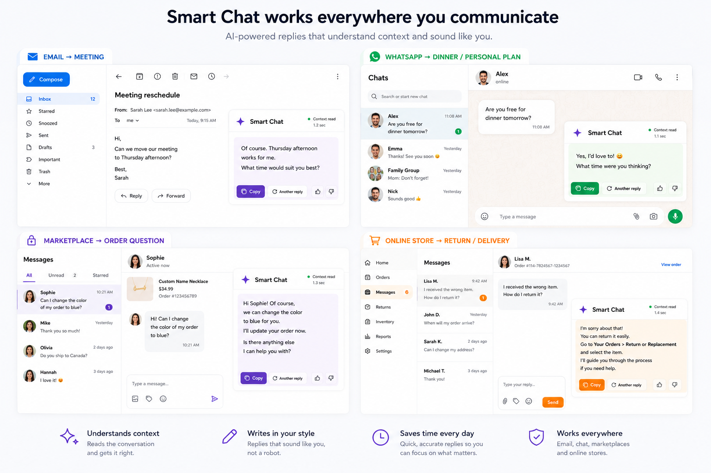

# Smart Chat

Final project for the Building AI course

## Summary

Smart Chat is an AI assistant that works alongside any writing field. It uses recent conversation context to suggest relevant replies within seconds, while also allowing users to write their own prompts and generate alternative responses.



## Setup (Phase 2 — running the app locally)

Phase 2 adds a small Node.js/Express backend that calls the real Claude API. Your API key stays on your machine and is never committed to Git or sent to the browser.

1. **Install dependencies**
   ```
   npm install
   ```
2. **Add your API key**
   Copy `.env.example` to a new file named `.env`, then open `.env` and paste in your own Anthropic API key:
   ```
   cp .env.example .env
   ```
   ```
   ANTHROPIC_API_KEY=your-real-key-here
   PORT=3000
   ```
   Your key is yours alone — don't paste it into chat messages, commit it, or share the `.env` file with anyone. `.env` is already listed in `.gitignore`, so `git status` should never show it as a file to be committed.
3. **Start the server**
   ```
   npm start
   ```
4. Open **http://localhost:3000** in your browser. The frontend is now served by the same backend that talks to Claude, so no separate setup is needed.

## Phase 3 — Chrome Extension MVP

Phase 3 adds a Chrome extension (`extension/`) that lets you select a conversation on **any** webpage and get a reply suggestion in a Chrome side panel — without leaving the page. The extension is just a client: it talks only to your local Smart Chat backend, never to the Claude API directly, and it does **not** contain an API key anywhere in its files.

### 1. Start the backend

The extension needs the Phase 2 backend running locally. In the project folder:

```
npm install
npm start
```

Leave this running in a terminal — you should see `Smart Chat server running on http://localhost:3000`. If you close the terminal or stop the server, the extension will still open, but any reply request will fail with a clear message telling you the server isn't running.

### 2. Load the extension in Chrome

1. Open Chrome and go to `chrome://extensions`.
2. Turn on **Developer mode** (toggle in the top-right corner).
3. Click **Load unpacked**.
4. Select the `extension/` folder inside this project (`Smart-Chat/extension`).
5. "Smart Chat" should now appear in your extensions list with a blue icon. Pin it to the toolbar for easy access (puzzle-piece icon → pin).

If you make changes to any file inside `extension/` later, come back to `chrome://extensions` and click the refresh icon on the Smart Chat card to reload it.

### 3. Try it out

1. Open any webpage with some text on it (an email, a forum thread, a WhatsApp Web chat, etc.).
2. Select the message(s) you want to reply to with your mouse.
3. Click the **Smart Chat** icon in the Chrome toolbar. A side panel opens on the right.
4. The selected text is automatically loaded into **Recent conversation**. If it's empty, or you select different text afterward, click **Capture Conversation** to re-read the current selection.
5. Pick a tone (**Warm**, **Professional**, or **Short** — Professional is the default, and your last choice is remembered next time).
6. Optionally type an **Additional instruction** (e.g. "make it shorter").
7. Click **Suggest Reply**. The AI-generated reply appears in an editable box.
8. Use **Copy** to copy it to your clipboard and paste it wherever you need, or **Another Reply** to generate a different suggestion for the same conversation.

The small status dot at the top of the panel shows whether it can reach the local backend ("Server connected" / "Server offline").

### If the backend isn't running

The panel will show: *"Smart Chat server is not running. Start the local server and try again."* Go back to your terminal, run `npm start` (see step 1), then click **Suggest Reply** again — no need to reload the extension or the page.

### Security notes

- The extension only ever calls `http://localhost:3000/api/suggest-reply` and `/api/health` — nothing else, and never `api.anthropic.com` directly.
- There is no Anthropic API key in any file under `extension/`. The key lives only in your local `.env`, which the extension cannot read.
- The extension requests the minimum Chrome permissions needed (`sidePanel`, `activeTab`, `scripting`, `storage`) — no broad `<all_urls>` access, and it only reads the page's current text selection when you explicitly click the extension icon or the Capture Conversation button.
- Nothing is ever sent from the page automatically — you choose what to select, and you choose when to click Suggest Reply.

## Background

People write messages every day across many different platforms, including WhatsApp, email, social media, marketplaces, customer service systems, and business tools. AI can already help people write better replies, but using it often requires a repetitive process: switching to a separate AI application, copying the recent conversation, explaining the context, asking for a response, and then copying the result back to the original application.

Smart Chat aims to reduce this unnecessary process by bringing AI assistance directly to the conversation.

The main problems it addresses are:

* Constantly switching between a conversation and a separate AI application
* Repeatedly copying and pasting previous messages to provide context
* Spending time explaining the same situation to the AI
* Difficulty finding the right wording, tone, or response
* Writing in a second language
* Managing large numbers of repetitive or context-dependent messages

My personal motivation comes from both my professional and everyday communication. I manage international customer conversations in e-commerce, write emails and messages in English, and sometimes use AI for everyday conversations, including WhatsApp messages. I use AI not only for translation or grammar, but also to improve tone, clarity, and wording, or simply to help me find the right response.

However, the AI usually does not know what happened before. I often need to copy the previous messages, explain the situation, and then move the generated answer back to the original conversation. Repeating this process across different applications made me ask a simple question:

**What if, instead of bringing the conversation to the AI, we could bring the AI to the conversation?**

This question is the main idea behind Smart Chat.

## How is it used?

Smart Chat is designed to work alongside the application or writing field that the user is already using.

When the user opens Smart Chat, the assistant reads the available recent conversation context. Within one or two seconds, it suggests a relevant reply in a small window.

The user can then:

* Copy the suggested reply with a single **Copy** button and paste it directly into the active conversation
* Ask the AI to generate another response
* Write a specific instruction such as “make it shorter,” “reply politely,” or “translate this into English”
* Write a completely new question or prompt instead of using the automatic suggestion
* Edit the generated response before using it

For example, a user may be replying to a customer email, an e-commerce message, or a WhatsApp conversation. Instead of copying the previous messages into a separate AI chatbot and explaining the situation, the user opens Smart Chat. The assistant uses the recent conversation context to suggest an appropriate response. The user can then copy the suggestion with one click and paste it directly into the conversation.

Smart Chat could be useful for:

* Everyday conversations
* Emails
* Customer service
* E-commerce messages
* Sales and business communication
* Communication in a second language

The main users could include customer service professionals, e-commerce sellers, sales professionals, freelancers, people communicating in a second language, and anyone who frequently writes context-dependent messages.

## Data sources and AI methods

Smart Chat would primarily use the recent conversation context available on the user's screen or in the active application. Depending on the application and the user's permission, this could include the latest message, several previous messages, or text selected by the user.

The project would not require a large, fixed dataset collected in advance. Instead, the most important data would be the temporary context of the current conversation. This context would be sent to a language model together with instructions for generating a relevant response.

The main AI method would be natural language processing using a large language model. The model would analyze the conversation to understand:

* The topic and recent context
* The language being used
* The likely intent of the other person
* The appropriate tone and level of formality
* The type of response that may be useful

The system could then generate one or more suggested replies. User feedback, such as choosing a suggestion, requesting a new answer, or editing the result, could later be used to improve personalization.

## Challenges

The biggest challenge is privacy. Smart Chat may need access to personal messages, emails, customer conversations, or other sensitive information. Users must clearly understand what information the assistant can read and must have control over when access is allowed.

Other challenges include:

* Protecting private and sensitive information
* Preventing unnecessary storage of conversations
* Asking for clear user permission before reading context
* Understanding which parts of the screen belong to the relevant conversation
* Generating incorrect, inappropriate, or misleading responses
* Understanding humor, sarcasm, emotions, and complex personal situations
* Working across different applications and operating systems

Smart Chat should never send a message automatically without the user's approval. The user should always review, edit, and decide whether to use the AI-generated response.

The project also does not solve every communication problem. AI cannot fully understand human relationships, emotions, or intentions, and its suggestions should be treated as assistance rather than perfect answers.

## What next?

Smart Chat could grow from a simple reply assistant into a more personal AI communication companion.

Future versions could:

* Learn the user's preferred writing style and tone
* Suggest different reply options, such as friendly, professional, short, or detailed
* Work across multiple languages
* Summarize long conversations before generating a response
* Remember user-approved preferences without storing unnecessary private conversations
* Support voice input and spoken replies
* Work across desktop and mobile devices
* Integrate with email, messaging, e-commerce, and customer service applications

A more advanced version could understand not only the current message but also the user's communication preferences and the nature of the relationship or conversation.

To develop the project further, I would need more knowledge of software development, application integration, AI APIs, privacy and security, and user interface design. A working prototype would also require testing with real users to understand when automatic suggestions are useful and when they become distracting.

## Acknowledgments

* The idea was inspired by my own experience using AI for professional and everyday communication.
* The project was developed as the final project for the Building AI course by Reaktor Innovations and the University of Helsinki.
* The Smart Chat concept image was created specifically for this project using AI-assisted image generation.
* No external code, images, or datasets were used in the initial project concept.
